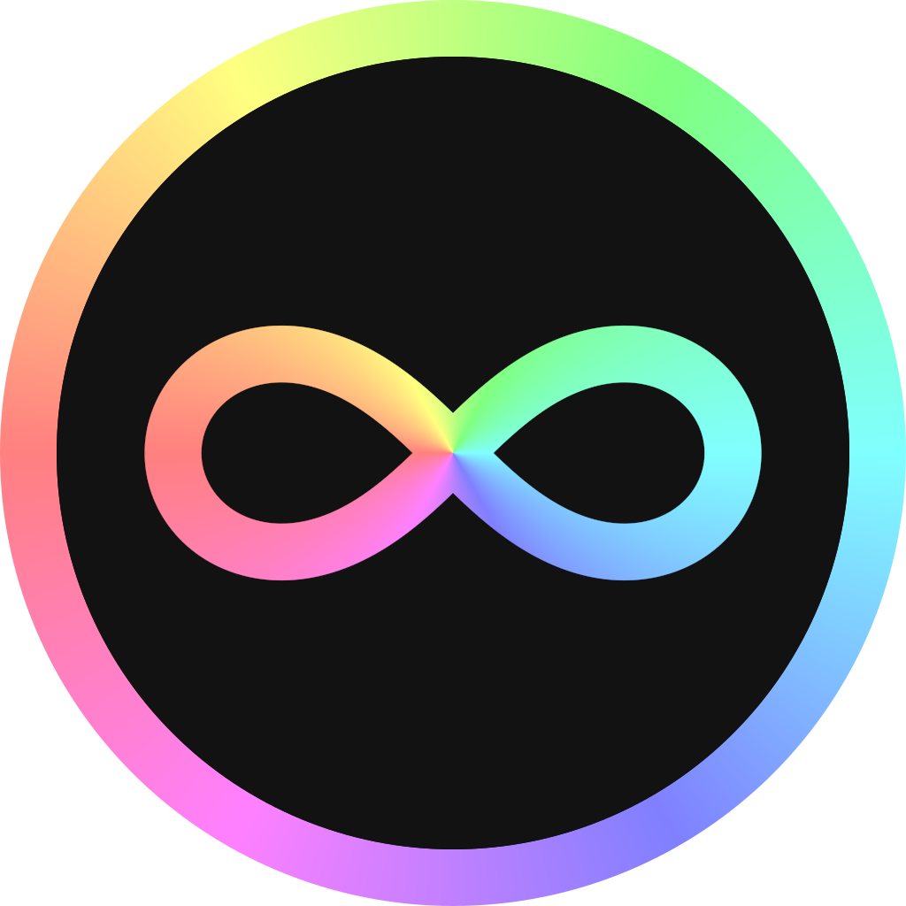

<!--
Copyright (C) 2023 Aaron Yeoh Cruz <zeyonaut@gmail.com>

SPDX-License-Identifier: CC0-1.0
-->

<div align="center">

<br>
  
# Inksy

An infinite scratchpad for effortless chirography.

<br>
</div>

<p align="center">

</p>

## About

Inksy is a minimalist drawing application with a focus on ergonomics, primarily intended for notetaking.

Inksy is currently in an early stage of development, so file formats are not final—upgrade versions at your own risk!

## Features

- **Supported Platforms**: Windows.
- Pressure-sensitive drawing with Wintab-compatible tablets.
- Image pasting (PNG, BMP).

## Shortcuts
A selection of useful shortcuts are listed below:

- Tabbed navigation (`Ctrl-N`, `Ctrl-W`, `Ctrl-←`, `Ctrl-→`).
- Save (`Ctrl-S` `Ctrl-Shift-S`) and load (`Ctrl-O`).
- Pan (`Space-Drag`), zoom (`Ctrl-Space-Drag`), and tilt (`Shift-Space-Drag`).
- Tools: select (`S`), pen (`B`), translate (`T`), scale (`Ctrl-R`), rotate (`Shift-R`).
- Undo (`Z`) and redo (`Shift-Z`).
- Copy (`Ctrl-C`) and paste (`Ctrl-V`).
- Color picking (`Tab`).
- Toggle full screen (`Ctrl-Shift-F`).
- Debug view (`F3`).
 
## Configuration

Configuring the editor can be done through creating a configuration file at `%appdata%\inksy\inksy.kdl` in [KDL](https://github.com/kdl-org/kdl/blob/main/SPEC.md):
```kdl
default-canvas-color 0x12 0x12 0x12
default-stroke-color 0xff 0xff 0xff
default-stroke-radius 4.0
```

## License

The source code of Inksy is distributed under the terms of the [Mozilla Public License 2.0](/LICENSES/MPL-2.0.txt).

Other resources, including fonts and images, are colocated with their license information within this repository.

See [/LICENSES/](/LICENSES/) for details.
